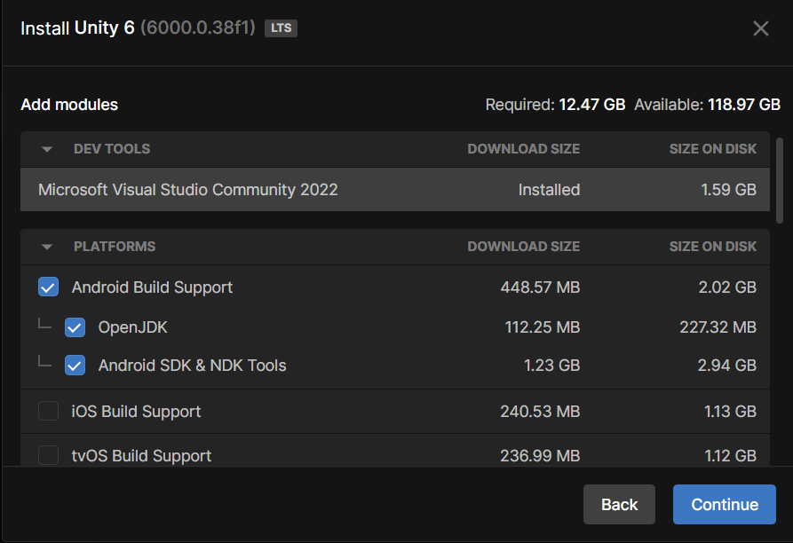
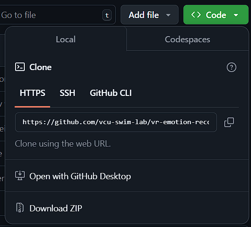

# Emotion Gathering Tool
## Setup the project

1. Get Unity 6 from the [Unity Hub](https://unity.com/unity-hub).

2. When picking the platforms for Unity, make sure to select "Android Build Support", along with the "Android SDK & NDK Tools and OpenJDK" sub-options selected, like shown below.

3. Open the project on [Github](https://github.com/vcu-swim-lab/vr-emotion-study.git), download it (click Code > Download Zip) and unzip at your location of choice.

## Setup the headset

1. Install the [Meta Quest Link](https://www.meta.com/quest/setup/) app and log in with your Meta account.
2. Open Meta Quest Link and on Settings > General, enable Unknown Sources. Then on the Beta tab, enable Public Test Channel. This is needed because the project needs some experimental features.
3. Connect your headset and open the settings app. On the beta features page, enable Eye tracking and Natural Facial Expression.

Now you are ready to run the project.

## Running the project

1. Open the project in Unity and press the play button to run it.
2. Try making different facial expressions while wearing the headset, the program will try to detect the emotion you are feeling and show it on the Unity console.
